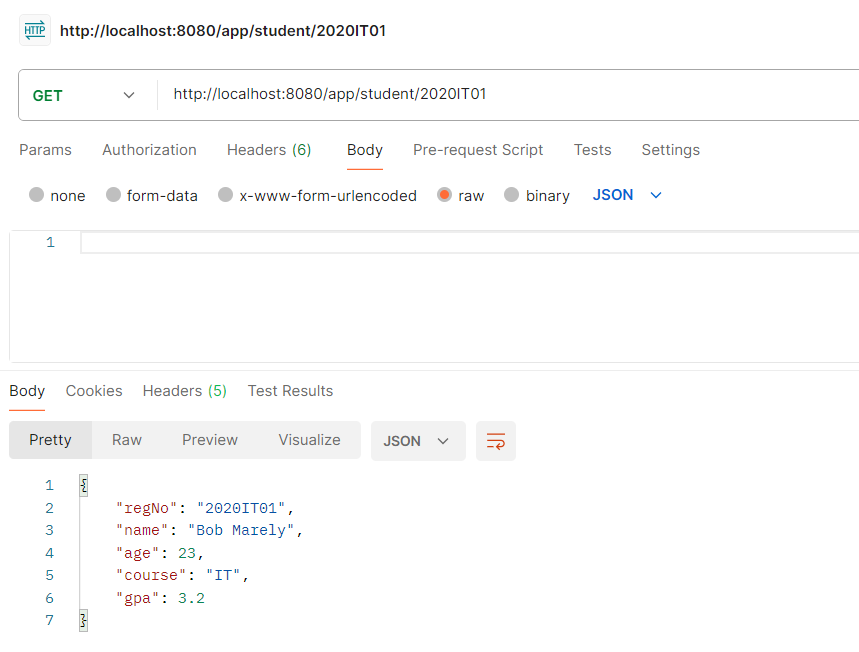
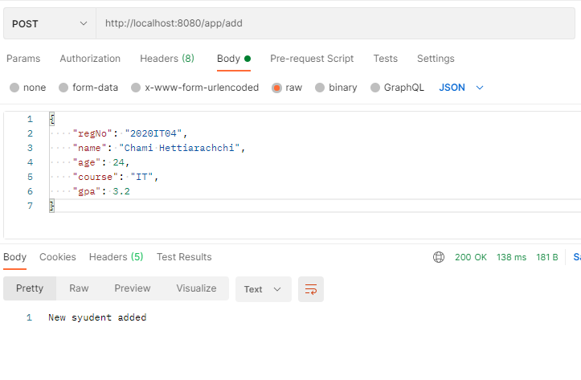
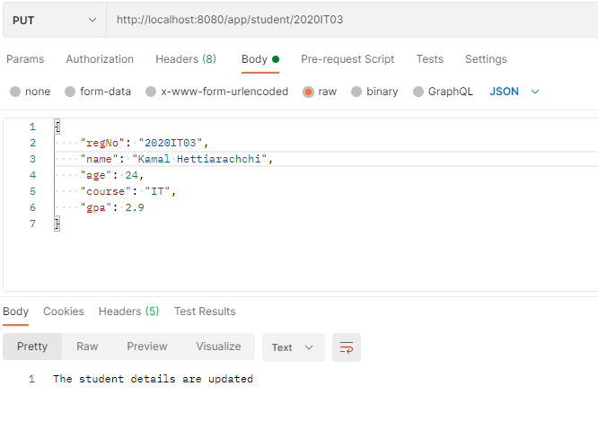

# IT3232_Day-04_Spring-Boot

# Student Management API

## 📖 Introduction
This is a simple Spring Boot REST API for managing student records. It allows users to perform CRUD (Create, Read, Update, Delete) operations on student data using HTTP requests.

---

##  📂 Code Structure

```java
package lk.ac.vau.fas.myapp.model;

public class Student {
    private String regNo;
	private String name;
	private int age;
	private String course;
	private double gpa;

    public Student(String regNo, String name, int age, String course, double gpa) {
        this.regNo = regNo;
        this.name = name;
        this.age = age;
        this.course = course;
        this.gpa = gpa;
    }

    public String getRegNo() {
        return regNo;
    }

    public void setRegNo(String regNo) {
        this.regNo = regNo;
    }

    public String getName() {
        return name;
    }

    public void setName(String name) {
        this.name = name;
    }

    public int getAge() {
        return age;
    }

    public void setAge(int age) {
        this.age = age;
    }

    public String getCourse() {
        return course;
    }

    public void setCourse(String course) {
        this.course = course;
    }

    public double getGpa() {
        return gpa;
    }

    public void setGpa(double gpa) {
        this.gpa = gpa;
    }
}

```
```java
package lk.ac.vau.fas.myapp.controller;

import org.springframework.web.bind.annotation.RequestMapping;
import org.springframework.web.bind.annotation.RestController;

import lk.ac.vau.fas.myapp.model.Student;

import java.util.ArrayList;
import java.util.HashMap;
import java.util.List;
import java.util.Map;

import org.springframework.web.bind.annotation.DeleteMapping;
import org.springframework.web.bind.annotation.GetMapping;
import org.springframework.web.bind.annotation.PathVariable;
import org.springframework.web.bind.annotation.PostMapping;
import org.springframework.web.bind.annotation.PutMapping;
import org.springframework.web.bind.annotation.RequestBody;


@RestController
@RequestMapping("/app")
public class AppController {

    Student Bob = new Student("2020IT01","Bob Marely",23,"IT",3.2);
	Student Amal = new Student("2020IT02","Amal Perera",24,"AMC",3.7);
	Student Nimal = new Student("2020IT03","Nimal Hettiarachchi",22,"IT",3.0);
    private static List<Student> students = new ArrayList<Student>();
    private Map<String, Student> mstudents = new HashMap<String,Student>();

    public AppController() {
        students.add(Bob);
        students.add(Amal);
        students.add(Nimal);

        mstudents.put(Bob.getRegNo(),Bob);
		mstudents.put(Amal.getRegNo(),Amal);
		mstudents.put(Nimal.getRegNo(),Nimal);
    }


    public Map<String,Student> getStudents(){
		return mstudents;
	}
    //find a student from the list by regno
    @GetMapping("/student/{id}")
	public Student getStudent(@PathVariable("id") String regno) {
        return mstudents.get(regno);
		//return null;
    }
    //Add a new Student
	@PostMapping("/add")
	public String addStudent(@RequestBody Student student) {
		mstudents.put(student.getRegNo(),student);
		return "New syudent added";
	}

    //Delete the student
	@DeleteMapping("/student/{id}")
	public String DeleteStudent(@PathVariable("id") String regno) {
		if(mstudents.remove(regno)!=null) {
			mstudents.remove(regno);
			return "The student removed";
		}
		return "404 coudn't find the student";
	}

    //Update the student
	@PutMapping("/student/{id}")
	public String UpdateStudent(@PathVariable("id") String regno, @RequestBody Student student) {
		if(mstudents.get(regno)!=null) {
			mstudents.put(student.getRegNo(),student);
			return "The student details are updated";
		}
		return "404 coudn't find the student";
	}
    
}
```
## 📂 API Endpoints

| Method | Endpoint               | Description                         |
|--------|------------------------|-------------------------------------|
| GET    | `/app/student/{id}`    | Get student by registration number  |
| POST   | `/app/add`             | Add a new student                   |
| DELETE | `/app/student/{id}`    | Delete a student                    |
| PUT    | `/app/student/{id}`    | Update a student                    |

---

## 📝 Code Explanation 
- @RestController: Tells Spring Boot that this class will handle REST API requests.

- @RequestMapping("/app"): All the API URLs in this class will start with /app.

- @RequestBody:Take the data from the body of the HTTP request and convert it into a Java object. 

- students: A list to hold student objects.

- mstudents: A map (like a dictionary) that stores students with the registration number as the key.

---

## 📌 Technologies Used

- **Java** (JDK 8+)
- **Spring Boot** (Web Dependency)
- **Maven** (for project build)
- **REST API** (via Spring MVC annotations)

---


## 🚀 Features

- Retrieve a specific student by registration number
- Add a new student
- Delete a student by registration number
- Update student details
- Preloaded list of students on application start

---
## Outputs

### 1. Get student by registration number


### 2. Add a new student


### 3. Delete a student


### 4. Update a student



