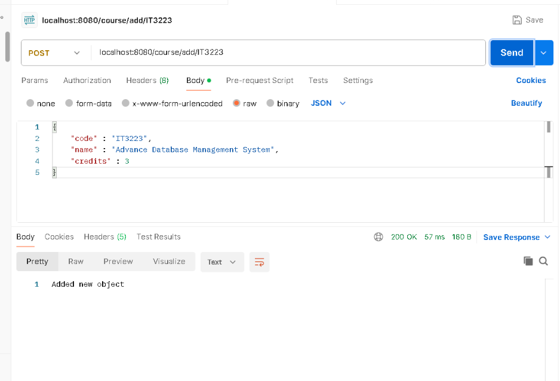
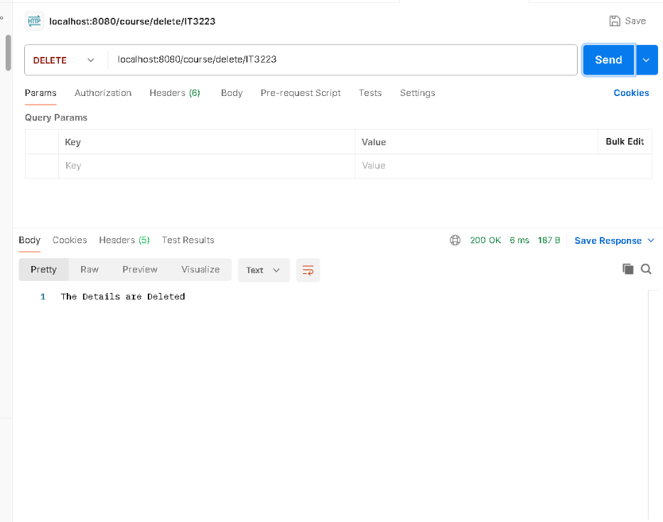
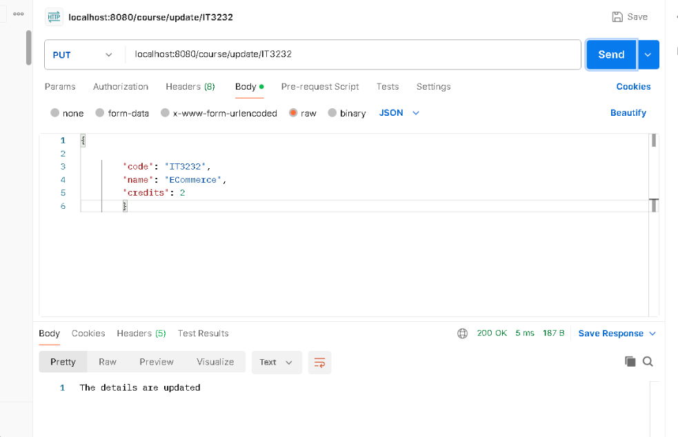

# IT3232_Day-05_Spring-Boot

# Generic CRUD-Based Course Management System using Spring Boot

## 📖 Introduction
This Java Spring Boot application provides a RESTful API to manage Course information using a generic CRUD controller. The system is designed to perform basic Create, Read, Update, and Delete (CRUD) operations on Course objects stored in memory using a HashMap.

The architecture uses a generic base controller (CRUDController<K, T>) to define common CRUD methods, which can be reused for different models. The ClassController extends this base controller and provides a concrete implementation for the Course model.

The Course class represents a simple data model with fields for course code, name, and credits. Three sample courses are added to the system to simulate existing data.

This application is ideal for learning how to:

- Create reusable REST controllers using generics.

- Build simple APIs using Spring Boot.

- Manage in-memory data without using a database.


---

##  📂 Code Structure

```java
package lk.ac.vau.fas.myapp.model;
public class Course {
    private String code;
	private String name;
	private String credits;
    public Course(String code, String name, String credits) {
        this.code = code;
        this.name = name;
        this.credits = credits;
    }
    public String getCode() {
        return code;
    }
    public void setCode(String code) {
        this.code = code;
    }
    public String getName() {
        return name;
    }
    public void setName(String name) {
        this.name = name;
    }
    public String getCredits() {
        return credits;
    }
    public void setCredits(String credits) {
        this.credits = credits;
    }
}

```
```java
package lk.ac.vau.fas.myapp.controller;

import org.springframework.web.bind.annotation.RequestMapping;
import org.springframework.web.bind.annotation.RestController;
import lk.ac.vau.fas.myapp.model.Course;

@RestController
@RequestMapping("/course")
public class ClassController extends CRUDController<String, Course>  {
    Course ecommerce = new Course("IT3232","E-Commerce",2);
    Course webappservice = new Course("IT2234","Web Service And Server Technology",4);
    Course webapplication = new Course("CSC3132","Web Application Development",2);

    getMap().put(ecommerce.getCode(), ecommerce);
    getMap().put(webappservice.getCode(),webappservice);
    getMap().put(webapplication.getCode(),webapplication);

}
```
```java
package lk.ac.vau.fas.myapp.controller;
import java.util.HashMap;
import java.util.Map;

import org.springframework.web.bind.annotation.DeleteMapping;
import org.springframework.web.bind.annotation.GetMapping;
import org.springframework.web.bind.annotation.PathVariable;
import org.springframework.web.bind.annotation.PostMapping;
import org.springframework.web.bind.annotation.PutMapping;
import org.springframework.web.bind.annotation.RequestBody;

public class CRUDController<K,T> {
    private Map<K, T> object = new HashMap<K,T>();
	
	public Map<K,T> getMap()
	{
		return object;
	}

    //get All 
	@GetMapping("/")
	public Map<K, T> getAll()
	{
		return object;
	}

    //Add new object
	@PostMapping("/add/{id}")
    public String addNew(@RequestBody T objects, @PathVariable("id") K id) {
        this.object.put(id, objects);
        return "Added new object";
    }

    //delete
	@DeleteMapping("/delete/{id}")
	public String DeleteOne(@PathVariable("id") K id)
	{
		if(object.get(id) != null)
		{
			object.remove(id);
			return "The Details are Deleted";
		}
		return "404 couldn't find the object";
		
	}

    //update 
	@PutMapping("/update/{id}")
    public String updateOne(@PathVariable("id") K id, @RequestBody T objects) 
	{
		 if(this.object.get(id) != null)
		 {
            this.object.put(id, objects);
            return "The details are updated";
        }
        return "404 couldn't find the object";
    }
    
}

```
## 📂 API Endpoints

| Method | Endpoint               | Description         |
|--------|------------------------|---------------------|
|GET     | `course/`              | Get all courses     |
|POST    | `course/add/{id}`      | Add a new course    |
|DELETE  | `course/delete/{id}`   | Delete a course     |
|PUT     | `course/update/{id}`   | Update a course     |

---

## 📝 Code Explanation 
1. **ClassController**: Manages course-related operations

2. **CRUDController**: A generic controller providing basic CRUD operations.

3. **Course**: This code defines a Course class in Java with three attributes—code, name, and credits—along with a constructor and getter/setter methods to manage course details.


---

## 📌 Technologies Used

- **Java** (JDK 8+)
- **Spring Boot** (Web Dependency)
- **Spring Web** (Spring MVC)
- **Java Generics**(reusable CRUDController<K, T>)
- **Maven** (for project build)
- **Collections** (HashMap)
- **REST API** (via Spring MVC annotations)

---


## 🚀 Features

- Generic Controller:Reusable CRUD logic for any object type
- RESTful API:Follows standard HTTP verbs and endpoints
- Course Model:Represents course data with fields and accessors
- Simple Map-based Storage:In-memory storage using HashMap

---
## Outputs

### 1. Get all courses


### 2. Add a course


### 3. Delete a course


### 4. Update a course



