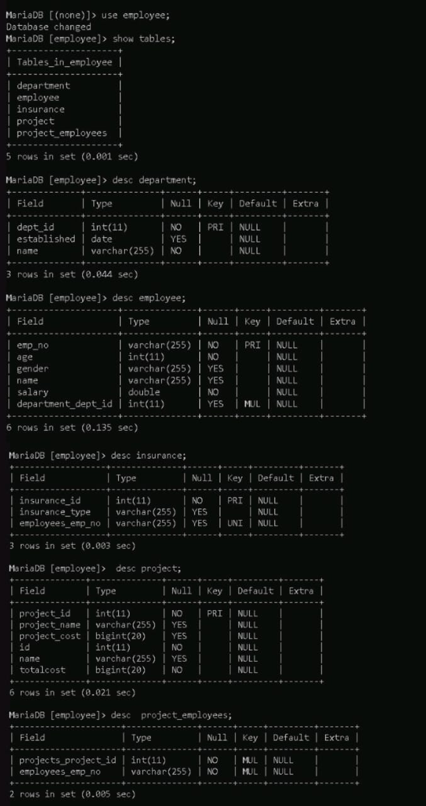

# IT3232_Day-06_Spring-Boot

# 🧾 Employee Management System

## 📌 Introduction

The **Employee Management System** is designed to simulate a real-world enterprise database environment by showcasing how different entities (such as departments, employees, and projects) are interrelated in an organization. This project focuses on data modeling using JPA annotations and database integration using Spring Boot and MySQL.

---

## 🏗️ Project Structure

1. **Department.java**

-This class contains three fields: id (a unique identifier marked with @Id and @Column(name="dept_id")), name (which cannot be null), and established (a Date indicating when the department was founded).

-The department is associated with multiple employees using a one-to-many relationship. This is defined by the @OneToMany(mappedBy="department") annotation, which means that the Employee entity contains the foreign key and maintains the relationship. In simple terms, each department can have many employees.

2. **Employee.java**

-The Employee class represents an individual working in the organization. 

-It is also marked with @Entity and contains fields for empNo (employee number, which serves as the primary key), name, age, gender, and salary. 

-Each employee is associated with a single department, which is expressed using a @ManyToOne relationship. This means that many employees can belong to one department.

-Additionally, employees can work on multiple projects, and projects can include multiple employees, so a @ManyToMany(mappedBy="employees") relationship is used to link them to the Project entity.

-Lastly, an employee can have one insurance policy. This is a one-to-one relationship between Employee and Insurance, where each employee has at most one insurance record.

3. **Insurance.java**

-The Insurance class represents an insurance policy held by an employee.

-This entity includes an id (marked with @Id and @Column(name="Insurance_id")) and a type field (marked with @Column(name="Insurance_type")) . 

-The class uses a @OneToOne annotation to represent a one-to-one relationship with the Employee entity. This means that each insurance record is associated with exactly one employee, and each employee has one insurance record.

4. **Project.java**

-The Project class models a business project within the company.

-It is a JPA entity containing the fields id (primary key), name, and totalcost.

-Projects are associated with employees through a many-to-many relationship, represented by @ManyToMany.In the Project class, this relationship is the owning side and does not use mappedBy, which allows it to define the join table for the connection between projects and employees.

---

## 💡 Code Structure

```java
package lk.vau.fas.ict.daysix.model;

import java.sql.Date;
import java.util.List;

import jakarta.persistence.Column;
import jakarta.persistence.Entity;
import jakarta.persistence.Id;
import jakarta.persistence.OneToMany;

@Entity
public class Department {
    @Id
    @Column(name="dept_id")
    private int id;
    @Column(nullable=false)
    private String name;
    private Date established;

    @OneToMany(mappedBy="department")
	private List<Employee>employees;
}

```
```java
package lk.vau.fas.ict.daysix.model;

import java.util.List;

import jakarta.persistence.Entity;
import jakarta.persistence.Id;
import jakarta.persistence.ManyToMany;
import jakarta.persistence.ManyToOne;

@Entity
public class Employee {
    @Id
    private String empNo;
	private String name;
	private int age;
	private String gender;
	private double salary;

    @ManyToOne
	private Department department;

    @ManyToMany(mappedBy="employees")
	private List<Project>projects;
}

```
```java
package lk.vau.fas.ict.daysix.model;

import jakarta.persistence.Column;
import jakarta.persistence.Entity;
import jakarta.persistence.Id;
import jakarta.persistence.OneToOne;
@Entity
public class Insurance {
    @Id
	@Column(name="Insurance_id")
    private int id;
    @Column(name="Insurance_type")
    private String type;

    @OneToOne
	private Employee employees;
}

```
```java
package lk.vau.fas.ict.daysix.model;

import java.util.List;

import jakarta.persistence.Entity;
import jakarta.persistence.Id;
import jakarta.persistence.JoinColumn;
import jakarta.persistence.JoinTable;
import jakarta.persistence.ManyToMany;


@Entity
public class Project {
    @Id
    private int id;
	private String name;
	private long totalcost;

    @ManyToMany
	private List<Employee>employees;
    
}

```
---
## ⚙️ Application Configuration
```
spring.application.name=daysix
spring.datasource.url=jdbc:mysql://localhost:3306/employee
spring.datasource.username=root
spring.datasource.password=
spring.datasource.driver-class-name=com.mysql.cj.jdbc.Driver
spring.jpa.hibernate.ddl-auto=create
```
---

## 🛠 Technologies
- Java 

- Spring Boot 

- Spring Data JPA

- MySQL 

- Hibernate ORM

- Jakarta Persistence API

- Maven (for dependency management)

---

## 🔑 Features
- Manage Employee information (name, age, gender, salary, etc.)

- Assign Employees to a Department

- Assign multiple Employees to multiple Projects

- Link each Employee with one Insurance policy

- Handle relational data using JPA annotations

- Automatically generate database schema (ddl-auto=create)

- Modular and extensible entity structure

---

## 🔗 Entity Relationships

| Entity     | Relationship Type | Target Entity | Description                                   |
| ---------- | ----------------- | ------------- | --------------------------------------------- |
| Department | One-to-Many       | Employee      | A department has many employees               |
| Employee   | Many-to-One       | Department    | Each employee belongs to one department       |
| Employee   | Many-to-Many      | Project       | Employees can work on multiple projects       |
| Project    | Many-to-Many      | Employee      | Projects can have multiple employees          |
| Employee   | One-to-One        | Insurance     | Each employee has one insurance policy        |
| Insurance  | One-to-One        | Employee      | Each insurance policy belongs to one employee |

---
## 🚀 How to Run

1.Ensure MySQL server is running and a database named employee exists.

2.Clone the repository.

3.Open the project in your IDE.

4.Update application.properties with your DB credentials.

5.Run the application using:
```
mvn spring-boot:run
```

## Output




