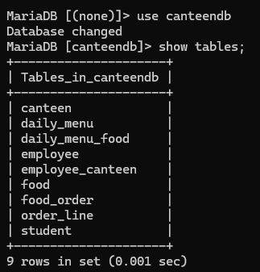
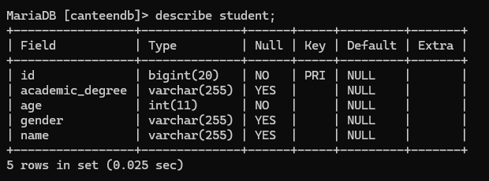
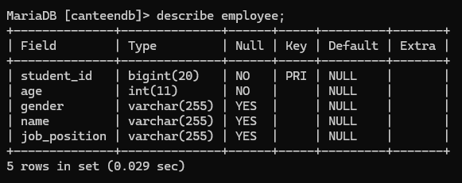
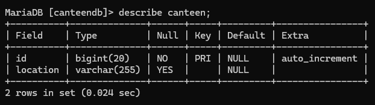
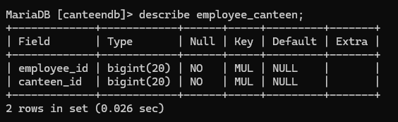
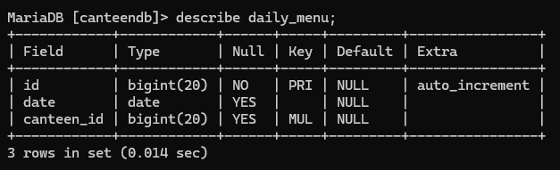
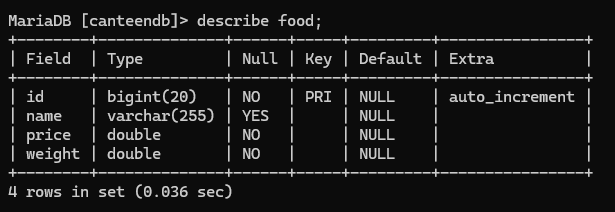
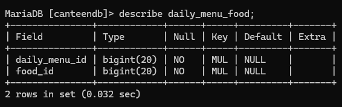
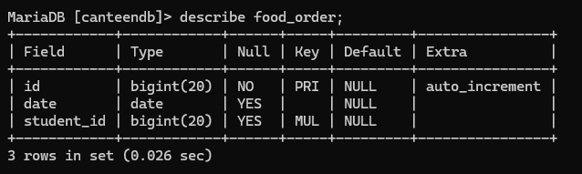
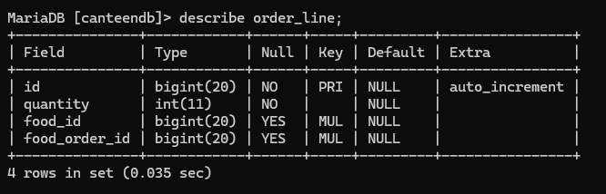

# IT3232_Day-08-ICA 01_Spring-Boot

# Canteen Management System

## 📝 Question

University Vavuniya wants to build a Smart Canteen Management System using Spring Boot. 
The system must manage multiple canteens, each located in different parts of the campus. 
The university maintains a list of foods which can only be sold at the canteen. Each food item 
has a name, price, and weight.  Each canteen offers a daily menu that includes several food 
items, where a single food item can appear on menus in different canteens on different days. 

The university has students and employees, both of whom have common details such as ID, 
name, age, and gender. Employees have additional attributes like their job position, and 
students include their academic degree. Employees can be associated with multiple canteens, 
while each student can place food orders. Every food order can include multiple order lines, 
and each line refers to a specific food item from the daily menu, along with the quantity. A 
student may place multiple orders over time, and each order must store the date it was placed. 

1) The following requirements are given to create proper models, implement the 
necessary relationships between the entity classes based on the provided scenario, 
and migrate them as a database using proper ORM techniques. 

2) After the migration, take a backup of the generated database and display the 
description of each table.  

---

## 🛠 Technologies
- Spring Boot — framework to build Java applications easily.

- Spring Data JPA — to interact with the database using Java objects (no need to write a lot of SQL).

- Hibernate — JPA provider that handles mapping between Java classes and database tables.

- MySQL — the relational database you're connecting to.

- JDBC (Java Database Connectivity) — standard Java API to connect to databases.

- MySQL Connector/J — the JDBC driver for MySQL databases.

---

## ✨ Features
- Database Connectivity — connecting a Spring Boot app to a MySQL database.

- Entity-Relationship Mapping — mapping Java classes (entities) to database tables automatically.

- Automatic Table Management — using spring.jpa.hibernate.ddl-auto=create, the app creates tables based on your entity classes every time it runs.

- Configuration via application.properties — easily managing settings like database URL, username, password, driver class, etc.

- Application Naming — setting a custom name for your Spring Boot application (spring.application.name=dayeight).

---
## Outputs

