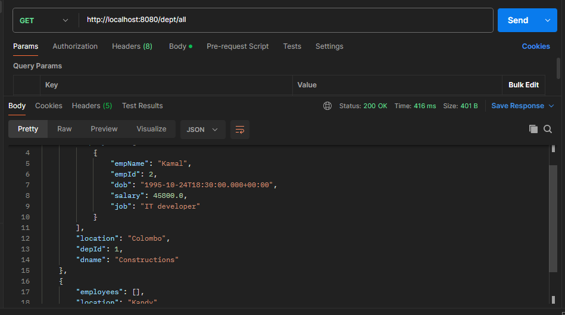
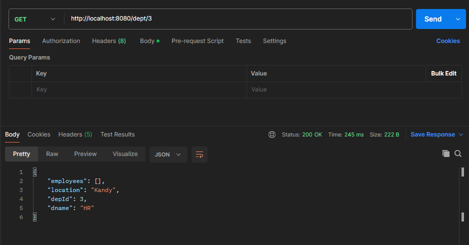
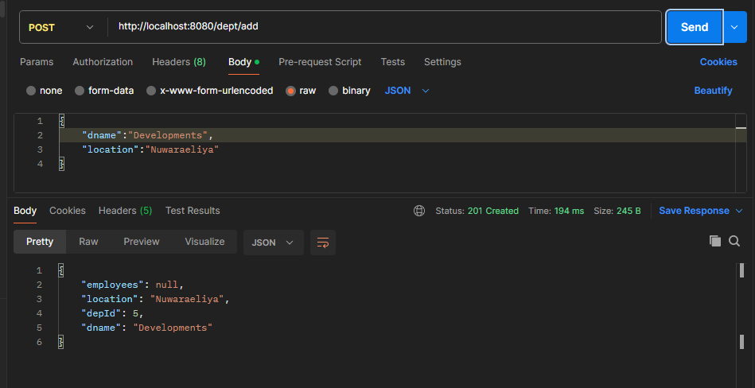
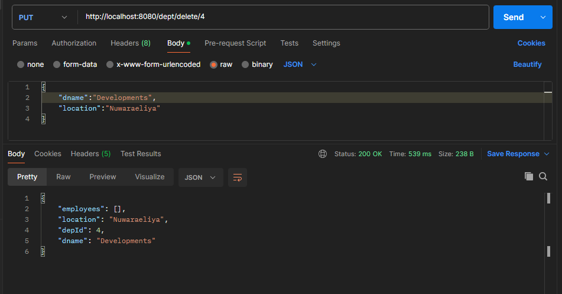
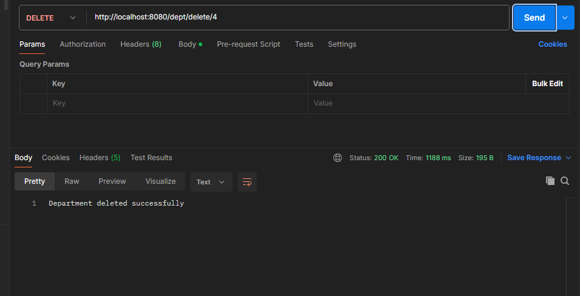

# Day 9

#  🔖 Department Management System

This is a simple Spring Boot application for managing departments and employees in an organization. It uses Spring Data JPA with a MySQL database.

## ✨ Features

- Retrieve all departments
- Retrieve a department by its ID
- Define `Department` and `Employee` entities with a one-to-many relationship
- Connect to MySQL database
- RESTful API structure

##  🧰 Technologies Used

- Java
- Spring Boot
- Spring Data JPA
- MySQL
- Jakarta Persistence API (JPA)

##  📁 Project Structure
```
src/main/java/
├── lk/vau/fas/ict/controller/DepartmentController.java
├── lk/vau/fas/ict/model/Department.java
├── lk/vau/fas/ict/model/Employee.java
├── lk/vau/fas/ict/repo/DepartmentRepo.java
├── lk/vau/fas/ict/service/DepartmentService.java
```
## 🛢️ Database Configuration
```
spring.application.name=ict
spring.datasource.url=jdbc:mysql://localhost:3306/employeedb
spring.datasource.username=root
spring.datasource.password=
spring.datasource.driver-class-name=com.mysql.cj.jdbc.Driver
spring.jpa.hibernate.ddl-auto=create
```

## 📦 Models

01. Department
```java
package lk.vau.fas.ict.model;

import java.sql.Date;
import java.util.List;

import jakarta.persistence.Column;
import jakarta.persistence.Entity;
import jakarta.persistence.GeneratedValue;
import jakarta.persistence.GenerationType;
import jakarta.persistence.Id;
import jakarta.persistence.OneToMany;

@Entity(name = "department")
public class Department {
    @Id
    @GeneratedValue(strategy = GenerationType.IDENTITY)
    @Column(name="dept_id")
    private int id;
    @Column(nullable=false)
    private String name;
    private Date established;
    @OneToMany(mappedBy="department")
	private List<Employee>employees;

    public Department(int id, String name, Date established) {
        this.id = id;
        this.name = name;
        this.established = established;
    }
    public int getId() {
        return id;
    }
    public void setId(int id) {
        this.id = id;
    }
    public String getName() {
        return name;
    }
    public void setName(String name) {
        this.name = name;
    }
    public Date getEstablished() {
        return established;
    }
    public void setEstablished(Date established) {
        this.established = established;
    }

    
}
```

02. Employee
```java
package lk.vau.fas.ict.model;

import java.sql.Date;

import com.fasterxml.jackson.annotation.JsonBackReference;

import jakarta.persistence.Entity;
import jakarta.persistence.GeneratedValue;
import jakarta.persistence.GenerationType;
import jakarta.persistence.Id;
import jakarta.persistence.ManyToOne;
@Entity
public class Employee {
    @Id
    @GeneratedValue(strategy = GenerationType.IDENTITY)
    private Long EmpId;
    private String EmpName;
    private String Job;
    private double Salary;
    private Date DOB;

    @ManyToOne
    @JsonBackReference
    private Department department;

    public Employee() {}

    public Employee(Long empId, String empName, String job, double salary, Date dOB, Department department) {
        EmpId = empId;
        EmpName = empName;
        Job = job;
        Salary = salary;
        DOB = dOB;
        this.department = department;
    }

    public Long getEmpId() {
        return EmpId;
    }

    public void setEmpId(Long empId) {
        EmpId = empId;
    }

    public String getEmpName() {
        return EmpName;
    }

    public void setEmpName(String empName) {
        EmpName = empName;
    }

    public String getJob() {
        return Job;
    }

    public void setJob(String job) {
        Job = job;
    }

    public double getSalary() {
        return Salary;
    }

    public void setSalary(double salary) {
        Salary = salary;
    }

    public Date getDOB() {
        return DOB;
    }

    public void setDOB(Date dOB) {
        DOB = dOB;
    }

    public Department getDepartment() {
        return department;
    }

    public void setDepartment(Department department) {
        this.department = department;
    }
}
```

##  📁 Controllers

01. DepartmertController.java
```
package lk.vau.fas.ict.controller;

import java.util.List;

import org.springframework.beans.factory.annotation.Autowired;
import org.springframework.http.HttpStatus;
import org.springframework.http.ResponseEntity;
//import org.springframework.web.bind.annotation.DeleteMapping;
import org.springframework.web.bind.annotation.GetMapping;
import org.springframework.web.bind.annotation.PathVariable;
//import org.springframework.web.bind.annotation.PostMapping;
//import org.springframework.web.bind.annotation.PutMapping;
//import org.springframework.web.bind.annotation.RequestBody;
import org.springframework.web.bind.annotation.RequestMapping;
import org.springframework.web.bind.annotation.RestController;

//import lk.ac.vau.fas.ict.DepartmentRepo;
import lk.vau.fas.ict.model.Department;
import lk.vau.fas.ict.service.DepartmentService;
@RestController
@RequestMapping("/dept")
public class DepartmentController {
    @Autowired
    public DepartmentService service;

    public ResponseEntity<List<Department>>getDepts(){
		return new ResponseEntity<List<Department>>
			(service.getDepts(),HttpStatus.OK);
	}
    @GetMapping("/{id}")
	public ResponseEntity<Department>getDepts(@PathVariable("id") int id){
		if(service.getDept(id)== null) {
			return new ResponseEntity<Department>
			(service.getDept(id),HttpStatus.NOT_FOUND);
		}
		return new ResponseEntity<Department>
		(service.getDept(id),HttpStatus.OK);
	}
    /* 
    @PostMapping
	public String addDept(@RequestBody Department department) {
		repo.save(department);
		return "New department added";
	}

    @PutMapping("/{id}")
	public String updateDept(@PathVariable("id") int id,@RequestBody Department department) {
		if(repo.findById(id).isEmpty()) {
			return "Couldn't find the department";
		}
		repo.save(department);
		return "The department updated";
	}

    @DeleteMapping("/{id}")
	public String deleteDept(@PathVariable("id") int id) {
			if(repo.findById(id).isEmpty()) {
				return "Couldn't find the department";
			}
			repo.deleteById(id);
			return "The department deleted";
	
	}
    */
}

```

## 📚 Repositories

01.DepartmentRepo.java
```
package lk.vau.fas.ict.repo;

import org.springframework.data.jpa.repository.JpaRepository;
import org.springframework.stereotype.Repository;

import lk.vau.fas.ict.model.Department;

@Repository
public interface DepartmentRepo extends JpaRepository<Department,Integer> {

}

```

## 🧠 Service

01. DepartmentService.java
```
package lk.vau.fas.ict.service;

import java.util.List;

import org.springframework.beans.factory.annotation.Autowired;
import org.springframework.stereotype.Service;
import org.springframework.web.bind.annotation.GetMapping;
import org.springframework.web.bind.annotation.PathVariable;

import lk.vau.fas.ict.model.Department;
import lk.vau.fas.ict.repo.DepartmentRepo;

@Service
public class DepartmentService {
    @Autowired
    private DepartmentRepo repo;

    @GetMapping
    public List<Department>getDepts(){
		return repo.findAll();
	}

    public Department getDept(@PathVariable("id") int id) {
		if(repo.findById(id).isEmpty()) {
			return null;
		}
		return repo.findById(id).get();
	}

}

```

## 🚀 How to Run
01. Make sure you have MySQL running and the database employeedb is created.

02. Clone the repository.

03. Update application.properties with your MySQL credentials.

04. Run the application using your IDE or command line:

```
mvn spring-boot:run
```
05. Access the endpoints using a REST client like Postman or curl.


## 📡 API Endpoints

01. Get All Departments
```
GET /dept
```

02. Get Department by ID
```
GET /dept/{id}
```

03.  Add a New Department

```
POST /dept

```

04. Update Department

```
PUT /dept/{id}

```

05. Delete Department

```
DELETE /dept/{id}

```


## Outputs

01. Get All Departments



02. Get Department by ID



03.  Add a New Department



04. Update Department



05. Delete Department




