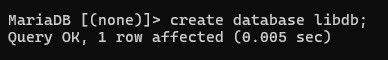

# 📚 Library Management System

Scenario: 

You're tasked with developing a RESTful API for a library management system that includes 
three models: Student, Book, and Borrow. Use the provided models and sample data to 
answer the questions below. 

Tasks: 

1.  Map the models to the database and insert the given data, then display the data in 
MySQL CMD.  

2. Filter the books by their genre. 

3. Find the students who borrowed the given book ID. 

4. To borrow a book, the library staff should enter the student ID and book ID, but 
before the borrowing process, validate the following conditions: 

    a. Ensure that the student and book IDs are available in the database.  
    b. If the student has more than two unreturned books, he/she is not eligible to 
    borrow a new book.  
    c. The library should maintain at least one copy available that is not for lending.  
    d. When a book is borrowed, decrease the available copy by one. 
    e. Return proper error messages when the conditions fail.

## 📁 Project Structure
```
lk.ac.vau.fas.ict
│
├── models
│   ├── Book.java
│   ├── Borrow.java
│   ├── ErrorResponce.java
│   └── Student.java
|
├── controller
│   ├── BookController.java
│   ├── BorrowController.java
|   └── StudentController.java
│
├── service
│   ├── BookService.java
│   ├── BorrowService.java
│   └── StudentService.java
├── repository
│   ├── BookRepository.java
│   ├── BorrowRepository.java
|   └── StudentRepository.java
│
└── exceptionHandler
    └── GenericExceptionHandler.java

```

## 🗃️ Database Configuration
The system connects to a MySQL database. Configure `application.properties`:
```
spring.application.name=ict
spring.datasource.url=jdbc:mysql://localhost:3306/libdb
spring.datasource.username=root
spring.datasource.password=
spring.datasource.driver-class-name=com.mysql.cj.jdbc.Driver
spring.jpa.hibernate.ddl-auto=update
```

## 📦 Models

01. Book.java
```java
package lk.ac.vau.fas.ict.models;

import java.sql.Date;
import java.util.List;

import com.fasterxml.jackson.annotation.JsonIgnore;

import jakarta.persistence.Entity;
import jakarta.persistence.Id;
import jakarta.persistence.OneToMany;

@Entity
public class Book {
	@Id
	private String id;
	private String title;
	private String author;
	private String isbn;
	private int copiesAvailable;
	private String genre;
	private Date publishedDate;
	@OneToMany(mappedBy = "book")
	@JsonIgnore
	private List<Borrow>borrows;
	public Book() {
		
	}
	public String getId() {
		return id;
	}
	public void setId(String id) {
		this.id = id;
	}
	public String getTitle() {
		return title;
	}
	public void setTitle(String title) {
		this.title = title;
	}
	public String getAuthor() {
		return author;
	}
	public void setAuthor(String author) {
		this.author = author;
	}
	public String getIsbn() {
		return isbn;
	}
	public void setIsbn(String isbn) {
		this.isbn = isbn;
	}
	public int getCopiesAvailable() {
		return copiesAvailable;
	}
	public void setCopiesAvailable(int copiesAvailable) {
		this.copiesAvailable = copiesAvailable;
	}
	public String getGenre() {
		return genre;
	}
	public void setGenre(String genre) {
		this.genre = genre;
	}
	public Date getPublishedDate() {
		return publishedDate;
	}
	public void setPublishedDate(Date publishedDate) {
		this.publishedDate = publishedDate;
	}
	public List<Borrow> getBorrows() {
		return borrows;
	}
	public void setBorrows(List<Borrow> borrows) {
		this.borrows = borrows;
	}
	
}

```

02. Borrow.java
```java
package lk.ac.vau.fas.ict.models;

import java.sql.Date;

import org.hibernate.annotations.ColumnDefault;

import jakarta.persistence.Column;
import jakarta.persistence.Entity;
import jakarta.persistence.EnumType;
import jakarta.persistence.Enumerated;
import jakarta.persistence.GeneratedValue;
import jakarta.persistence.GenerationType;
import jakarta.persistence.Id;
import jakarta.persistence.ManyToOne;

@Entity
public class Borrow {
	@Id
	@GeneratedValue(strategy = GenerationType.IDENTITY)
	private int id;
	@ManyToOne
	private Student student;
	@ManyToOne
	private Book book;
	//@Column(name="borrow_date",columnDefinition = "date default CURRENT_DATE")
	private Date borrowDate=new Date(System.currentTimeMillis());
	@ColumnDefault("null")
	private Date returnDate;	
	public enum Status {
	    NO,
	    YES
	}
	@Enumerated(EnumType.STRING)
	@Column(nullable = false)
	private Status returned=Status.NO;
	
	public Borrow() {
		
	}

	public int getId() {
		return id;
	}

	public void setId(int id) {
		this.id = id;
	}

	public Student getStudent() {
		return student;
	}

	public void setStudent(Student student) {
		this.student = student;
	}

	public Book getBook() {
		return book;
	}

	public void setBook(Book book) {
		this.book = book;
	}

	public Date getBorrowDate() {
		return borrowDate;
	}

	public void setBorrowDate(Date borrowDate) {
		this.borrowDate = borrowDate;
	}

	public Date getReturnDate() {
		return returnDate;
	}

	public void setReturnDate(Date returnDate) {
		this.returnDate = returnDate;
	}

	public Status getReturned() {
		return returned;
	}

	public void setReturned(Status returned) {
		this.returned = returned;
	}
	
}

```

03. Student.java
```java
package lk.ac.vau.fas.ict.models;

import java.util.List;

import com.fasterxml.jackson.annotation.JsonIgnore;

import jakarta.persistence.Entity;
import jakarta.persistence.Id;
import jakarta.persistence.OneToMany;


@Entity
public class Student {
	@Id
	private String id;
	private String name;
	private String department;
	private int year;
	@OneToMany(mappedBy = "student")
	@JsonIgnore
	private List<Borrow>borrows;
	public Student() {
		
	}
	public String getId() {
		return id;
	}
	public void setId(String id) {
		this.id = id;
	}
	public String getName() {
		return name;
	}
	public void setName(String name) {
		this.name = name;
	}
	public String getDepartment() {
		return department;
	}
	public void setDepartment(String department) {
		this.department = department;
	}
	public int getYear() {
		return year;
	}
	public void setYear(int year) {
		this.year = year;
	}
	public List<Borrow> getBorrows() {
		return borrows;
	}
	public void setBorrows(List<Borrow> borrows) {
		this.borrows = borrows;
	}
	
}

```

04. ErrorResponce.java
```java
package lk.ac.vau.fas.ict.models;

public class ErrorResponce {
	private int statusCode;
	private String errorMessage;
	public ErrorResponce() {
		
	}
	public ErrorResponce(int statusCode, String errorMessage) {
		super();
		this.statusCode = statusCode;
		this.errorMessage = errorMessage;
	}

	public int getStatusCode() {
		return statusCode;
	}
	public void setStatusCode(int statusCode) {
		this.statusCode = statusCode;
	}
	public String getErrorMessage() {
		return errorMessage;
	}
	public void setErrorMessage(String errorMessage) {
		this.errorMessage = errorMessage;
	}
	
	
}

```

##  📁 Controllers

01. BookController.java
```java
package lk.ac.vau.fas.ict.controllers;

import java.util.List;

import org.springframework.beans.factory.annotation.Autowired;
import org.springframework.http.HttpStatus;
import org.springframework.http.ResponseEntity;
import org.springframework.web.bind.annotation.GetMapping;
import org.springframework.web.bind.annotation.PathVariable;
import org.springframework.web.bind.annotation.RequestMapping;
import org.springframework.web.bind.annotation.RestController;

import lk.ac.vau.fas.ict.models.Book;
import lk.ac.vau.fas.ict.service.BookService;

@RestController
@RequestMapping("/books")
public class BookController {
    @Autowired
    public BookService bookService;

    @GetMapping("/{genre}")
    public ResponseEntity<List<Book>> getBooksByGenre(@PathVariable("genre") String genre){
        return new ResponseEntity<List<Book>>(bookService.getBooksByGenre(genre),HttpStatus.OK); 
    }
}
```

02. BorrowController.java
```java
package lk.ac.vau.fas.ict.controllers;

import org.springframework.beans.factory.annotation.Autowired;
import org.springframework.http.ResponseEntity;
import org.springframework.web.bind.annotation.PostMapping;
import org.springframework.web.bind.annotation.RequestBody;
import org.springframework.web.bind.annotation.RequestMapping;
import org.springframework.web.bind.annotation.RestController;

import lk.ac.vau.fas.ict.models.Borrow;
import lk.ac.vau.fas.ict.service.BorrowService;

@RestController
@RequestMapping("/borrows")
public class BorrowController {

    @Autowired
    public BorrowService borrowService;
    
    @PostMapping("/add")
    public ResponseEntity<Borrow> addBorrowEntry(@RequestBody Borrow borrow){
        Borrow saveBorrow = borrowService.addNewEntry(borrow);
        return ResponseEntity.ok(saveBorrow);
    }
}

```

03. StudentController.java
```java
package lk.ac.vau.fas.ict.controllers;

import java.util.List;

import org.springframework.beans.factory.annotation.Autowired;
import org.springframework.http.HttpStatus;
import org.springframework.http.ResponseEntity;
import org.springframework.web.bind.annotation.GetMapping;
import org.springframework.web.bind.annotation.PathVariable;
import org.springframework.web.bind.annotation.RequestMapping;
import org.springframework.web.bind.annotation.RestController;

import lk.ac.vau.fas.ict.models.Student;
import lk.ac.vau.fas.ict.service.StudentService;

@RestController
@RequestMapping("/students")
public class StudentController {
    @Autowired
    public StudentService studentService;

    @GetMapping("/{bookId}")
    public ResponseEntity<List<Student>> getBorrowedStudents(@PathVariable("bookId") String bookId) {
        return new ResponseEntity<List<Student>>(studentService.getBorrowedStudent(bookId),HttpStatus.OK);
    }
}

```

## 📚 Repositories

01.BookRepository.java
```java
package lk.ac.vau.fas.ict.repository;

import java.util.List;

import org.springframework.data.jpa.repository.JpaRepository;
import org.springframework.data.jpa.repository.Query;
import org.springframework.stereotype.Repository;

import lk.ac.vau.fas.ict.models.Book;

@Repository
public interface BookRepository extends JpaRepository<Book, String>{
    
    // Filter Books by genre
    @Query("SELECT b from Book b WHERE b.genre=?1")
    public List<Book> getByGenre(String genre);
}
```

02.BorrowRepository.java
```java
package lk.ac.vau.fas.ict.repository;

import org.springframework.data.jpa.repository.JpaRepository;
import org.springframework.stereotype.Repository;

import lk.ac.vau.fas.ict.models.Borrow;

@Repository
public interface BorrowRepository extends JpaRepository<Borrow, Integer>{
    
}

```

03.StudentRepository.java
```java
package lk.ac.vau.fas.ict.repository;

import java.util.List;

import org.springframework.data.jpa.repository.JpaRepository;
import org.springframework.data.jpa.repository.Query;
import org.springframework.stereotype.Repository;

import lk.ac.vau.fas.ict.models.Student;

@Repository
public interface StudentRepository extends JpaRepository<Student, String> {
    
    // Get student who borrowed books when given book id
    @Query("SELECT s from Student s JOIN s.borrows b WHERE b.book.id=?1")
    public List<Student> getBorrowedStudent(String bookId);
}

```

## 🧠 Service

01. BookService.java
```java
package lk.ac.vau.fas.ict.service;

import java.util.List;

import org.springframework.beans.factory.annotation.Autowired;
import org.springframework.stereotype.Service;

import jakarta.persistence.EntityNotFoundException;
import lk.ac.vau.fas.ict.models.Book;
import lk.ac.vau.fas.ict.repository.BookRepository;

@Service
public class BookService {
    @Autowired
    public BookRepository bookRepository;

    // Get book by genre
    public List<Book> getBooksByGenre(String genre){
        if(bookRepository.getByGenre(genre).isEmpty()){
            throw new EntityNotFoundException("Books Not Found for mentioned Genre");
        }
        return bookRepository.getByGenre(genre);
    }
}

```

02. BorrowService.java
```java
package lk.ac.vau.fas.ict.service;

import org.springframework.beans.factory.annotation.Autowired;
import org.springframework.dao.DataIntegrityViolationException;
import org.springframework.stereotype.Service;

import jakarta.persistence.EntityNotFoundException;
import lk.ac.vau.fas.ict.models.Book;
import lk.ac.vau.fas.ict.models.Borrow;
import lk.ac.vau.fas.ict.models.Student;
import lk.ac.vau.fas.ict.repository.BookRepository;
import lk.ac.vau.fas.ict.repository.BorrowRepository;
import lk.ac.vau.fas.ict.repository.StudentRepository;

@Service
public class BorrowService {
    @Autowired
    public BorrowRepository borrowRepository;

    @Autowired
    public BookRepository bookRepository;

    @Autowired
    public StudentRepository studentRepository;

    // Add a new Borrow Entry
    public Borrow addNewEntry(Borrow borrow) {
        Book book = bookRepository.findById(borrow.getBook().getId())
                .orElseThrow(() -> new EntityNotFoundException("Book Not Found"));

        Student student = studentRepository.findById(borrow.getStudent().getId())
                .orElseThrow(() -> new EntityNotFoundException("Student Not Found"));

        // Check available copies
        if (book.getCopiesAvailable() <= 1) {
            throw new IllegalStateException("Only one copy left. This must be reserved.");
        }

        // Count unreturned books
        long unreturnedCount = student.getBorrows().stream()
                .filter(b -> b.getReturned() == Borrow.Status.NO)
                .count();

        if (unreturnedCount >= 2) {
            throw new IllegalStateException("Student already has more than two unreturned books.");
        }

        // Proceed to borrow
        book.setCopiesAvailable(book.getCopiesAvailable() - 1);

        borrow.setBook(book);
        borrow.setStudent(student);
        borrow.setBorrowDate(new java.sql.Date(System.currentTimeMillis()));
        borrow.setReturned(Borrow.Status.NO);

        return borrowRepository.save(borrow);
    }

}

```

03. StudentService.java
```java
package lk.ac.vau.fas.ict.service;

import java.util.List;

import org.springframework.beans.factory.annotation.Autowired;
import org.springframework.stereotype.Service;

import jakarta.persistence.EntityNotFoundException;
import lk.ac.vau.fas.ict.models.Student;
import lk.ac.vau.fas.ict.repository.StudentRepository;

@Service
public class StudentService {
    @Autowired
    public StudentRepository studentRepository;

    public List<Student> getBorrowedStudent(String bookId){
        if(studentRepository.getBorrowedStudent(bookId).isEmpty()){
            throw new EntityNotFoundException("Students Not Found");
        }
        return studentRepository.getBorrowedStudent(bookId);
    }
}

```

## 🔍 exceptionHandler

01. GenericExceptionHandler.java
```java
package lk.ac.vau.fas.ict.exceptionHandler;

import org.springframework.dao.DataIntegrityViolationException;
import org.springframework.http.HttpStatus;
import org.springframework.http.ResponseEntity;
import org.springframework.web.bind.annotation.ExceptionHandler;
import org.springframework.web.bind.annotation.RestControllerAdvice;

import jakarta.persistence.EntityNotFoundException;
import lk.ac.vau.fas.ict.models.ErrorResponce;

@RestControllerAdvice
public class GenericExceptionHandler {

    @ExceptionHandler(EntityNotFoundException.class)
    public ResponseEntity<ErrorResponce> handleEntityNotFound(EntityNotFoundException exception) {
        ErrorResponce errorResponce = new ErrorResponce(HttpStatus.NOT_FOUND.value(),exception.getMessage().toString());
        return new ResponseEntity<ErrorResponce>(errorResponce,HttpStatus.NOT_FOUND);
    }

    @ExceptionHandler(DataIntegrityViolationException.class)
    public ResponseEntity<ErrorResponce> handleDataViolation(DataIntegrityViolationException exception) {
        ErrorResponce errorResponce = new ErrorResponce(HttpStatus.CONFLICT.value(),exception.getMessage().toString());
        return new ResponseEntity<ErrorResponce>(errorResponce,HttpStatus.CONFLICT);
    }

    @ExceptionHandler(Exception.class)
    public ResponseEntity<ErrorResponce> handleCommonException(Exception exception) {
        ErrorResponce errorResponce = new ErrorResponce(HttpStatus.INTERNAL_SERVER_ERROR.value(),exception.getMessage().toString());
        return new ResponseEntity<ErrorResponce>(errorResponce,HttpStatus.INTERNAL_SERVER_ERROR);
    }
}

```
## Sample data
```
-- Insert 10 Books
INSERT INTO book (id, title, author, genre, isbn, published_date, copies_available) VALUES
('B001', 'The Silent Patient', 'Alex Michaelides', 'Thriller', '9781250301697', '2019-02-05', 5),
('B002', 'Educated', 'Tara Westover', 'Memoir', '9780399590504', '2018-02-20', 3),
('B003', 'Becoming', 'Michelle Obama', 'Biography', '9781524763138', '2018-11-13', 4),
('B004', 'The Alchemist', 'Paulo Coelho', 'Fiction', '9780061122415', '1993-05-01', 2),
('B005', 'Atomic Habits', 'James Clear', 'Self-help', '9780735211292', '2018-10-16', 6),
('B006', 'Sapiens', 'Yuval Noah Harari', 'History', '9780062316097', '2015-02-10', 7),
('B007', 'The Subtle Art of Not Giving a F*ck', 'Mark Manson', 'Self-help', '9780062457714', '2016-09-13', 3),
('B008', '1984', 'George Orwell', 'Dystopian', '9780451524935', '1950-07-01', 4),
('B009', 'To Kill a Mockingbird', 'Harper Lee', 'Fiction', '9780060935467', '1960-07-11', 5),
('B010', 'The Great Gatsby', 'F. Scott Fitzgerald', 'Classic', '9780743273565', '1925-04-10', 2);

-- Insert 5 Students
INSERT INTO student (id, name, department, year) VALUES
('S001', 'Alice Johnson', 'Computer Science', 2),
('S002', 'Bob Smith', 'Mechanical Engineering', 3),
('S003', 'Clara Lee', 'Physics', 1),
('S004', 'David Kim', 'Mathematics', 4),
('S005', 'Emma Davis', 'Literature', 2);

-- Insert 15 Borrow Records
INSERT INTO borrow (id, book_id, student_id, borrow_date, return_date, returned) VALUES
(1, 'B001', 'S001', '2025-06-01', NULL, 'NO'),
(2, 'B002', 'S002', '2025-05-15', '2025-05-29', 'YES'),
(3, 'B003', 'S003', '2025-06-05', NULL, 'NO'),
(4, 'B004', 'S001', '2025-04-20', '2025-05-05', 'YES'),
(5, 'B005', 'S005', '2025-06-02', NULL, 'NO'),
(6, 'B006', 'S004', '2025-05-10', '2025-05-25', 'YES'),
(7, 'B007', 'S001', '2025-05-28', NULL, 'NO'),
(8, 'B008', 'S002', '2025-05-01', '2025-05-20', 'YES'),
(9, 'B009', 'S003', '2025-06-03', NULL, 'NO'),
(10, 'B010', 'S005', '2025-06-07', NULL, 'NO'),
(11, 'B003', 'S004', '2025-04-15', '2025-05-01', 'YES'),
(12, 'B001', 'S005', '2025-06-09', NULL, 'NO'),
(13, 'B002', 'S001', '2025-03-10', '2025-03-24', 'YES'),
(14, 'B005', 'S002', '2025-04-01', '2025-04-20', 'YES'),
(15, 'B004', 'S003', '2025-06-01', NULL, 'NO');

```

## 🌐 REST API Endpoints

01. GET /books/{genre} - Fetch books of a specific genre

02. POST /borrows/add - Create a new borrow record

03. GET /students/{bookId} - Get list of students who borrowed a book

## Outputs
- Sample MySQL




- Filter Books by Genre


- Find Students by Book ID


- Book Borrowing Logic


- Error Handling


## 🧠 Key Classes Explained

- **Book.java**: Defines the Book entity with attributes like title, author, genre, etc.
- **Borrow.java**: Represents a borrowing record between a student and a book with status tracking.
- **Student.java**: Models a student with details like name, department, and associated borrow records.
- **ErrorResponce.java**: A custom error response model to standardize error messages

- **BookService.java**: Contains logic to fetch books by genre with error handling.
- **BorrowService.java**: Validates and processes borrowing logic (e.g., copy availability, student limits).
- **StudentService.java**: Provides logic to fetch students based on book borrow history.

- **BookController.java**: Handles GET requests to fetch books by genre.
- **BorrowController.java**: Handles POST requests to create new borrow entries.
- **StudentController.java**: Retrieves students who borrowed a particular book.

- **BookRepository.java**: JPA interface with custom query to find books by genre.
- **BorrowRepository.java**: JPA interface for borrowing records.
- **StudentRepository.java**: JPA interface with query to find students by borrowed book ID.

- **GenericExceptionHandler.java**: Catches and customizes responses for exceptions like EntityNotFound and DataIntegrityViolation


## ✅ How to Run

01. Make sure you have MySQL running and the database employeedb is created.

02. Clone the repository.

03. Update application.properties with your MySQL credentials.

04. Run the application using your IDE or command line:

```
mvn spring-boot:run
```
05. Access the endpoints using a REST client like Postman or curl.

## ✅ Features

- Book filtering by genre.

- Borrowing system with validations (copy check & student limit).

- Student lookup by borrowed book.

- Custom error handling for clean API responses.

- Entity relationship mapping with JPA (One-to-Many, Many-to-One).

## 🛠️ Technologies Used

- **Java 17+**
- **Spring Boot**
- **Spring Data JPA**
- **MySQL**
- **Jakarta Persistence (JPA)**
- **Postman (for testing)**
- **Maven** for dependency management
- **RESTful Web Services**
